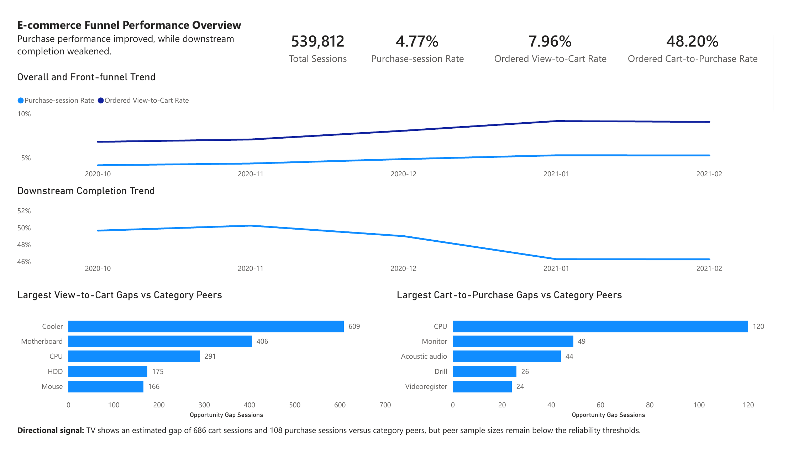
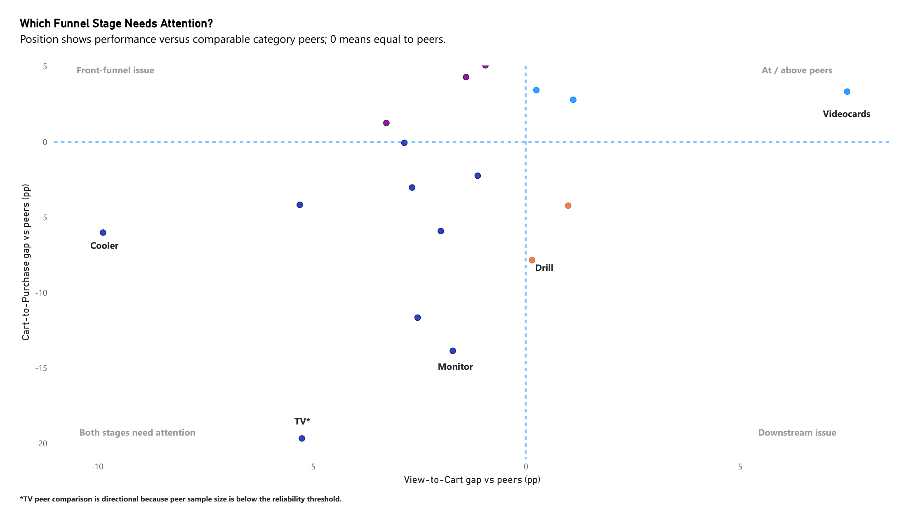

# E-commerce Funnel Diagnosis & Category Opportunity Prioritisation

**SQL · DuckDB · Power BI · Funnel Analysis · Peer Benchmarking**

An end-to-end e-commerce analytics case study that transforms **885K raw customer events** into reliable session-level funnel metrics, identifies where conversion friction occurs, and prioritises categories for further investigation.

## Business Question

**How can an e-commerce business identify where funnel performance is improving, where meaningful friction remains, and which categories should be investigated first?**

## Executive Summary

The analysis reconstructed **539,812 analytical sessions** from raw view, cart and purchase events and built ordered View-to-Cart and Cart-to-Purchase funnel metrics.

Key findings:

- Purchase-session rate increased from **4.19% to 5.30%**.
- Ordered View-to-Cart improved from **6.83% to 9.09%**.
- Ordered Cart-to-Purchase weakened from **49.67% to 46.28%**.
- Category peer benchmarking showed that low absolute conversion did **not always mean category-specific underperformance**.
- Opportunity prioritisation combined **performance gaps with denominator volume**, rather than ranking categories by conversion rate alone.
- Brand and price analysis identified investigation signals, but the available data was not sufficient to establish direct root causes.

---

## Analytical Challenge

The raw event data could not be used directly for reliable funnel analysis.

Three analytical issues had to be addressed before interpreting conversion performance.

### 1. Raw session IDs were not sufficient for analysis

The supplied session identifiers could span unusually long periods or be reused. I therefore reconstructed analytical sessions using:

- `user_id`
- the original session ID
- a **30-minute inactivity rule**

This produced **539,812 analytical sessions**.

A **60-minute sensitivity check** produced **531,421 sessions**, only about **1.55% fewer**, indicating that the main conclusions were not highly sensitive to the session timeout assumption.

### 2. Event presence does not necessarily mean funnel progression

A session containing both a view and a cart does not automatically mean that the view happened before the cart.

I therefore defined **ordered funnel metrics** that required the observed events to occur in sequence:

`View → Cart → Purchase`

This reduced the risk of treating simple event co-occurrence as genuine funnel progression.

### 3. One site-wide benchmark could misclassify categories

Different product families can have naturally different customer journeys.

I therefore used two benchmark levels:

- **Weighted overall benchmark** — to understand site-level performance.
- **Leave-one-out category peer benchmark** — to compare each category with other categories in the same category family.

This helped distinguish true category-specific underperformance from broader category-family behaviour.

---

## Methodology

The analysis followed six main stages:

1. **Profile the raw event data**  
   Checked event types, date coverage, category mapping, missing values, brand coverage and price distributions.

2. **Reconstruct analytical sessions**  
   Applied the 30-minute inactivity rule and validated the result with a 60-minute sensitivity check.

3. **Define ordered funnel metrics**  
   Built session-level View-to-Cart, Cart-to-Purchase and Purchase-session metrics using event sequence.

4. **Analyse performance over time**  
   Compared monthly funnel performance to identify which stage was driving overall change.

5. **Benchmark and prioritise categories**  
   Compared categories with relevant peers and combined performance gaps with denominator volume to identify investigation priorities.

6. **Investigate possible drivers**  
   Analysed brand and price patterns for selected categories while keeping causal limitations explicit.

   ---

## Key Findings

### Finding 1 — Overall purchase performance improved

From October 2020 to February 2021:

| Metric | Oct 2020 | Feb 2021 | Change |
|---|---:|---:|---:|
| Purchase-session rate | 4.19% | **5.30%** | +1.11 pp |
| Ordered View-to-Cart | 6.83% | **9.09%** | +2.26 pp |
| Ordered Cart-to-Purchase | 49.67% | **46.28%** | -3.39 pp |

The improvement in purchase-session performance was primarily driven by stronger **View-to-Cart conversion**.

At the same time, **Cart-to-Purchase weakened**, indicating that the downstream stage was moving in the opposite direction.

This means the business should not interpret the overall improvement as evidence that every part of the funnel was improving.

---

### Finding 2 — Low absolute conversion did not always mean a category problem

A key example was **computers.components.videocards**.

Its Cart-to-Purchase rate was:

**40.98%**

Compared with the overall known-category benchmark of **46.77%**, this initially appeared weak.

However, when compared with other categories in the same computer-components peer group, videocards performed:

**+3.34 percentage points above peers**

This changed the interpretation.

A site-wide benchmark would have incorrectly flagged videocards as an underperforming category.

The peer benchmark showed that its lower absolute conversion reflected broader category-family behaviour rather than a category-specific problem.

