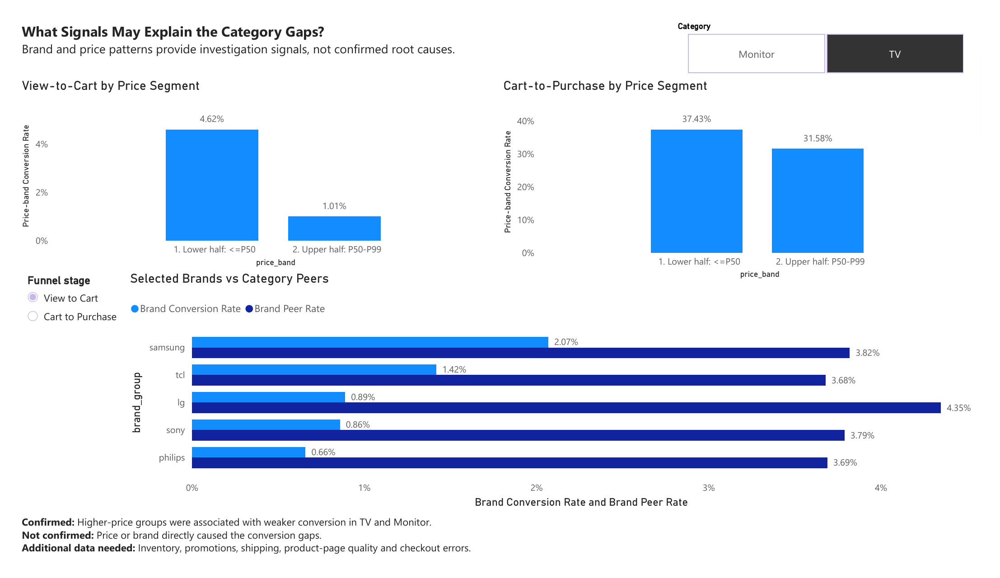
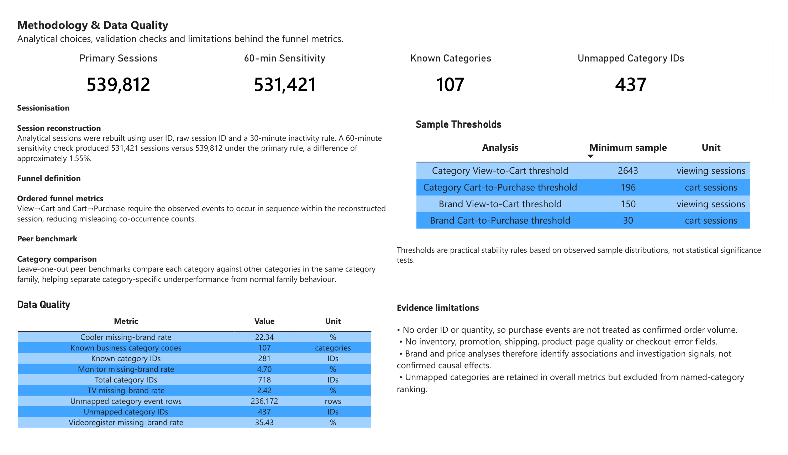

# E-commerce Funnel Diagnosis & Category Opportunity Prioritisation

**SQL · DuckDB · Power BI**

An end-to-end e-commerce analytics case study that transforms **885,129 raw customer events** into reliable session-level funnel metrics, diagnoses category-specific friction, and prioritises investigation opportunities.

## Business Question

**How can an e-commerce business identify where funnel performance is improving, where meaningful friction remains, and which categories should be investigated first?**

---

## Executive Summary

The analysis reconstructed **539,812 analytical sessions** and created ordered View-to-Cart and Cart-to-Purchase funnel metrics.

From October 2020 to February 2021:

| Metric | Oct 2020 | Feb 2021 | Change |
|---|---:|---:|---:|
| Purchase-session Rate | 4.19% | **5.30%** | +1.11 pp |
| Ordered View-to-Cart | 6.83% | **9.09%** | +2.26 pp |
| Ordered Cart-to-Purchase | 49.67% | **46.28%** | -3.39 pp |

**Main takeaway:** overall purchase-session performance improved alongside substantially stronger View-to-Cart progression, despite weaker downstream Cart-to-Purchase progression.

The analysis then used **leave-one-out category peer benchmarks** and denominator volume to identify which categories represented meaningful investigation opportunities.

---

## Category Diagnosis

A single site-wide conversion benchmark can create misleading conclusions because different product families may naturally have different customer journeys.

A key example was **computers.components.videocards**:

| Comparison | Cart-to-Purchase |
|---|---:|
| Videocards | **40.98%** |
| Overall known-category benchmark | 46.77% |
| Comparable category peers | **37.64%** |

Compared with the overall benchmark, Videocards initially appeared weak.

Compared with relevant peers, however, it performed **+3.34 percentage points above peer performance**.

This changed the interpretation from apparent underperformance to above-peer performance within its category family.

### Funnel-stage diagnosis

| Category | View→Cart vs peers | Cart→Purchase vs peers | Diagnosis |
|---|---:|---:|---|
| Cooler | **-9.86 pp** | -6.01 pp | Both stages require attention |
| Monitor | -1.70 pp | **-13.85 pp** | Mainly downstream |
| CPU | -1.98 pp | **-5.91 pp** | Downstream priority |
| Drill | +0.15 pp | **-7.84 pp** | Downstream-specific |
| Videocards | +7.50 pp | +3.34 pp | Above peers |

---

## Opportunity Prioritisation

Categories were not ranked by conversion rate alone.

Priority combined:

**denominator volume × performance gap versus peers**

### Largest reliable opportunities

| Funnel stage | Top category | Mathematical gap |
|---|---|---:|
| View-to-Cart | Cooler | **609 cart sessions** |
| View-to-Cart | Motherboard | 406 |
| View-to-Cart | CPU | 291 |
| Cart-to-Purchase | CPU | **120 purchase sessions** |
| Cart-to-Purchase | Monitor | 49 |
| Cart-to-Purchase | Acoustic audio | 44 |

These are **mathematical prioritisation gaps**, not forecasts of guaranteed incremental conversions.

TV showed a large directional signal, but its peer sample was below the reliability threshold, so it was kept separate from the reliable rankings.

---

## Driver Deep Dive

TV and Monitor were selected for deeper brand and price investigation because they had relatively strong driver-level data coverage.

### Price signal

| Category / Funnel | Lower-price half | Upper-price half |
|---|---:|---:|
| TV View→Cart | **4.62%** | **1.01%** |
| TV Cart→Purchase | 37.43% | 31.58% |
| Monitor View→Cart | **8.60%** | **6.34%** |
| Monitor Cart→Purchase | 38.56% | 33.54% |

Higher-priced groups were **associated with weaker conversion**, particularly for TV View-to-Cart.

### Brand signal

Examples included:

- **LG TV View→Cart:** 0.89% vs 4.35% peer rate
- **Philips Monitor Cart→Purchase:** 32.14% vs 42.53% peer rate

These patterns identify areas for further investigation but do **not establish that price or brand caused the conversion gaps**.

---

## Methodology & Reliability

Several analytical controls were used before interpreting the results:

- Analytical sessions were reconstructed from the raw `user_session` identifiers using a **30-minute inactivity rule**, with a new session beginning only when inactivity exceeded 30 minutes.
- A **60-minute sensitivity test** produced 531,421 sessions versus 539,812 under the primary rule — approximately **1.55% fewer**.
- Funnel progression is evaluated using the earliest observed timestamp for each stage; same-second transitions are retained because the source timestamps have second-level precision only.
- Category diagnosis uses weighted **leave-one-out peer benchmarks**.
- Practical sample thresholds are used to separate reliable from directional comparisons.
- Unmapped categories remain in overall metrics but are excluded from named-category rankings.
- Brand and price analyses are treated as associations rather than causal evidence.

---

## Recommended Follow-up

| Priority | Investigation focus |
|---|---|
| CPU | Inventory availability, delivery conditions, checkout issues and product-information clarity |
| Cooler | Assortment, price positioning and product-page quality |
| Monitor | Downstream completion, pricing and brand differences |
| TV | High-price positioning, promotions and value communication |
| Videoregister | Improve data coverage before deeper driver analysis |

Additional inventory, promotion, shipping, product-page and checkout data would be required for stronger root-cause diagnosis.

---

## Technical Implementation

The analysis uses different grains according to the business question:

- **Overall funnel:** Event → Session
- **Category diagnosis:** Session + Category
- **Brand analysis:** Session + Category + Brand
- **Price analysis:** Product-level price assignment → Session + Product
- **Power BI outputs:** purpose-built category, funnel-stage, brand and price-band semantic tables
---

## Project Files

### SQL

| File | Purpose |
|---|---|
| [`00_setup_import.sql`](sql/00_setup_import.sql) | Import the raw CSV into DuckDB |
| [`01_data_profiling.sql`](sql/01_data_profiling.sql) | Raw data profiling |
| [`02_session_reconstruction.sql`](sql/02_session_reconstruction.sql) | Session reconstruction and sensitivity test |
| [`03_funnel_metrics.sql`](sql/03_funnel_metrics.sql) | Ordered funnel metrics |
| [`04_time_trend_analysis.sql`](sql/04_time_trend_analysis.sql) | Monthly funnel trends |
| [`05_category_peer_analysis.sql`](sql/05_category_peer_analysis.sql) | Peer benchmarking and opportunity analysis |
| [`06_brand_price_drivers.sql`](sql/06_brand_price_drivers.sql) | Brand and price investigation |
| [`07_powerbi_output_tables.sql`](sql/07_powerbi_output_tables.sql) | Power BI semantic outputs |

### Documentation

- [Detailed Methodology](docs/methodology.md)
- [Data Dictionary](docs/data_dictionary.md)
- [Power BI Dashboard Design Notes](powerbi/README.md)

---

## Dataset

**eCommerce Events History in Electronics Store**

Source: [Kaggle dataset](https://www.kaggle.com/datasets/mkechinov/ecommerce-events-history-in-electronics-store)

The raw dataset is not redistributed in this repository.
